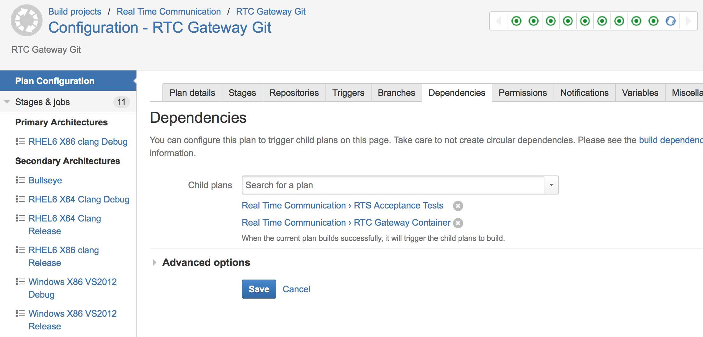
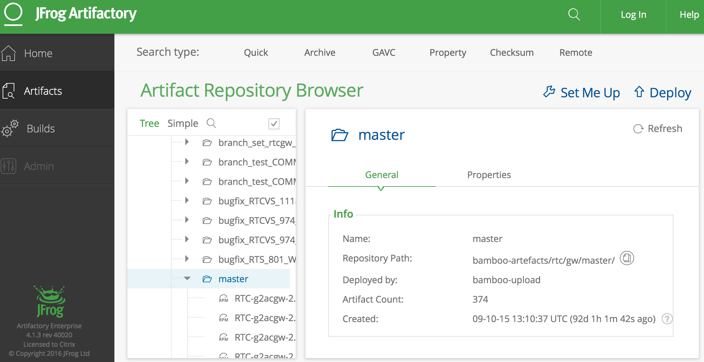
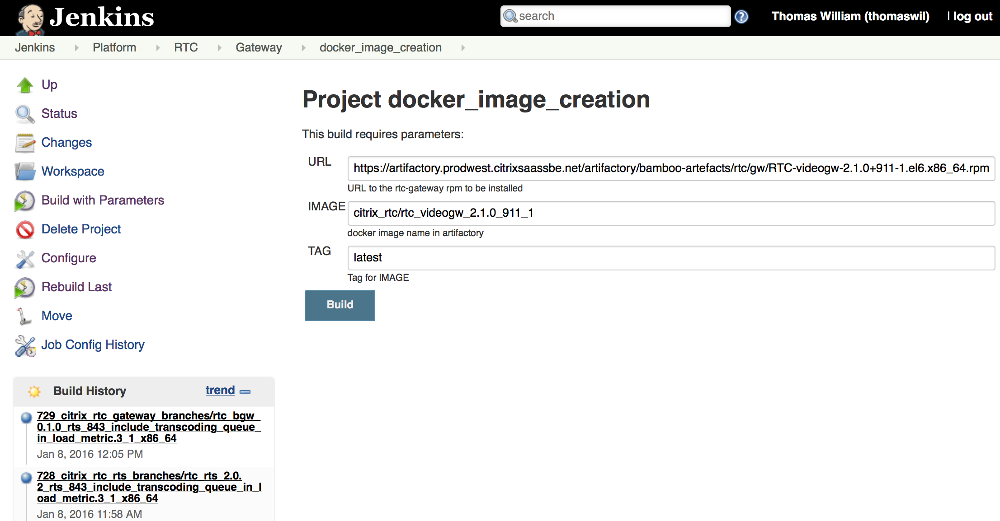

:id: status
:class: slide

Status March 2015
=================

- 3 different build and deploy systems
- 3 different SCM systems
- 4++ different code quality and code coverage systems
- Multiple different packaging and deployment workflows

:class: slide

Application Management
======================

- Bamboo (build & deploy)
- BuildForge (build & deploy)
- Jenkins (build & deploy)
- Artifactory (artifact store)
- Clover (code coverage)
- Confluence (wiki)
- Crowd (user mgmt)
- Crucible and FishEye (code review)
- JIRA (ticket/project mgmt)
- Stash (SCM)
- Perforce (SCM)
- Sonar (source quality mgmt)
- Splunk (logs)
- Zenoss (monitoring)

:class: slide

System / Infrastructure Administration
======================================

- CloudStack
- Windows/Unix/Mac build machines
- Application servers
- User management for the applications

:class: slide

Other Tools
===========

- BOM tool
- Build Dependency Tool
- uDeploy
- Electric Cloud
- PostgreSQL
- Signing Module

:class: slide
:id: machines1

Machines Managed Manually 1/2
=============================

.. image:: img/MachineInfo.png
   :height: 500px
   :alt: Wiki-page for machine info
   :align: center

:class: slide
:id: machines2

Machines Managed Manually 2/2
=============================

- Machines managed manually with ssh/scripts/build-plans
- Configurations differ between machines
- Buildplans therefor have to be tied to certain machines
- No equal load distribution
- Crash of single machine may block a plan/team

-> "Pets vs. Cattle"

:class: slide

Example Workflow
================

- Bamboo plan to build binaries from sources
	- Creates RPMs, stores them in NFS share
	- Triggers child plans
- Bamboo childplan using bash scripts to:
	- Upload rpms to Artifactory
	- Trigger docker container creation in Jenkins
- Jenkins plan that builds docker containers
	- Containers are stored in Artifactory
- Bamboo childplan for end2end tests in test environment using Cucumber

:class: slide
:id: RTCGW-Bamboo1

Bamboo Plan: RTCGW RPM Build
============================

.. image:: img/Gateway-Bamboo.png
   :height: 450px
   :alt: Gateway Project Plan
   :align: center

:class: slide
:id: RTCGW-Bamboo1a

Bamboo Plan Configuration
=========================

.. image:: img/Gateway-Bamboo-Config.png
   :height: 450px
   :alt: Gateway Project Plan Configuration
   :align: center

:class: slide
:id: RTCGW-Bamboo1b

Bamboo Child Plans
==================

:class: slide
:id: RTCGW-Bamboo2

Bamboo Plan: RTCGW RPM Upload
=============================

.. image:: img/Gateway-Bamboo-Docker.png
   :height: 450px
   :alt: Upload and Container trigger plan
   :align: center

:class: slide
:id: RTCGW-Artifactory

Artifact Store For RPMs
=======================

:class: slide
:id: RTCGW-Jenkins1

Jenkins Plan: RTCGW Container
=============================

:class: slide
:id: RTCGW-Bamboo3

Bamboo Plan: RTCGW Testdeploy
=============================

.. image:: img/Gateway-Bamboo-Deploy.png
   :height: 450px
   :alt: PlaceHolder
   :align: center

