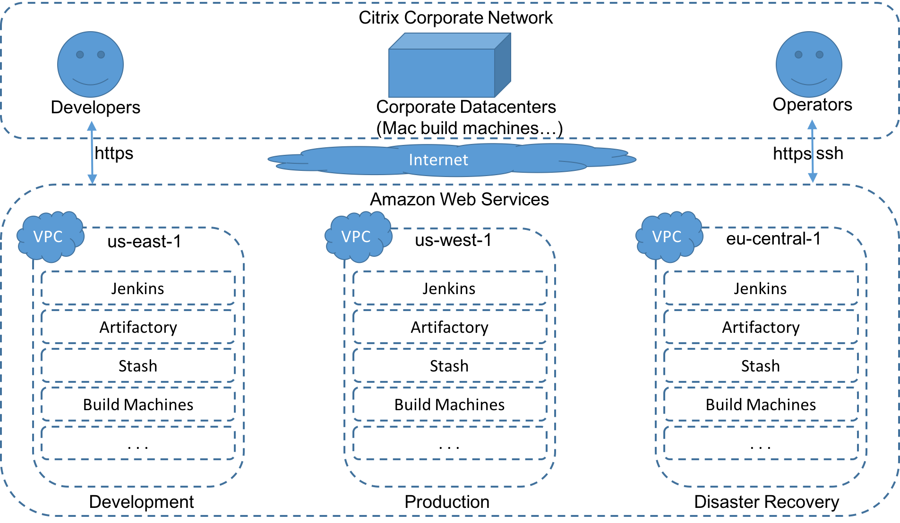

:class: slide

What Is The SBE In AWS?
=======================

* **SBE**: Secure Build Environment
    The new build environment currently in development

* **AWS**: Amazon Web Services
    Instead of in-house servers we now use Amazons EC2 instances to be scalable

* **EC2**: Amazon Elastic Compute Cloud
	Part of cloud-computing platform AWS, for renting_ virtual computers

.. _renting: http://www.ec2instances.info/

:class: slide
:id: SBE-Overview

SBE Overview
============

:class: slide
:id: SBE-Production

SBE Production
==============

.. image:: img/SBE-Production.png
   :height: 500px
   :alt: SBE Production
   :align: center
