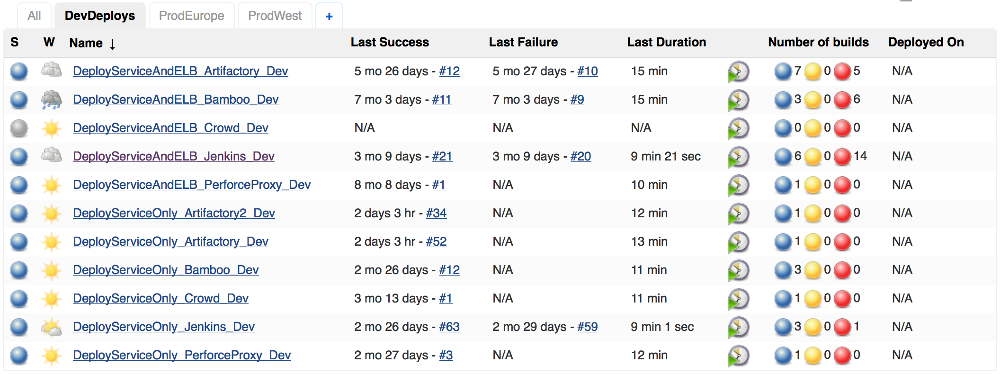
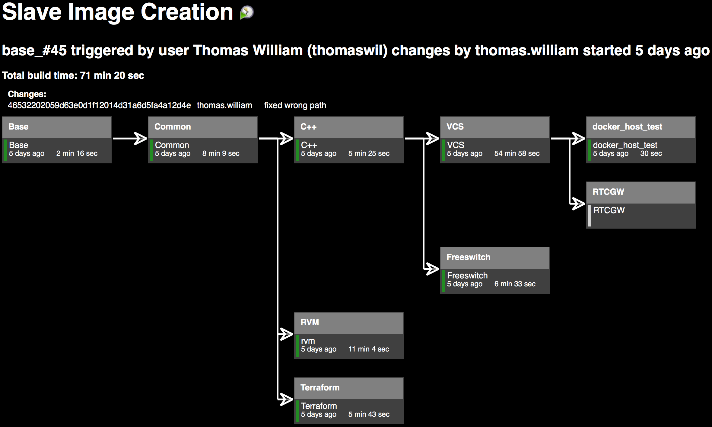

:class: slide

Infrastructure As Code (IAC)
============================

**Definition:**
  Infrastructure as Code (IAC) is a type of IT infrastructure that operations teams can automatically manage and provision through code, rather than using a manual process. Infrastructure as Code is sometimes referred to as programmable infrastructure.

----

:class: slide

- Concept of IAC is similar to programming scripts
- IAC uses higher-level or descriptive language to code:
    - Versatile and adaptive provisioning 
    - Deployment process(es)
- IAC process closely resembles formal software design practices:
    - Developers carefully control code versions
    - Test code iterations
    - Limit deployment until the software is proven and approved for production

:class: slide

Example
=======
Using Ansible (or Vagrant/Puppet/Chef/Salt...), an IT management and configuration tool, one could: 

- Install MySQL server,
- Verify that MySQL is running properly,
- Create a user account and password,
- Set up a new database and remove unneeded databases 

-> all through code.

:class: slide

Using code to provision and deploy servers and applications is particularly interesting to software developers:

- No dependency on system administrators to provision and manage the operations aspect of a DevOps environment
- IAC process can provision and deploy a new application for quality assurance or experimental deployment

:class: slide

IAC also introduces potential disadvantages:

- IAC code development may require additional tools that could introduce learning curves and room for error
- Errors in IAC code can proliferate quickly through servers
- Monitoring/peer review for version control and comprehensive pre-release testing is mandatory
- If administrators can change server configurations without changing IAC code:
    - Potential for configuration drift
    - Inconsistent configurations across data centers

----

:class: slide

It is therefor important to fully integrate IAC into:

- Systems administration
- IT operations
- DevOps processes
- With well-documented policies and procedures

**1, 2, automate**
  DevOps mantra meaning you should consider automating everything you envision to do more than 2 times in the foreseable future.
  

:class: slide

IAC @ Citrix
============
- Jenkins node itself is build and deployed using Jenkins job
    - Jenkins service and ELB as two cloud formations
- Build slave images are created using Jenkins jobs
- Jenkins can run build jobs inside docker containers
    - A generic docker build slave can be reused by different jobs
    - The docker images are build with Jenkins jobs

:class: slide

Jenkins Deploys Jenkins
=======================

:class: slide

Docker Image Creation
=====================

