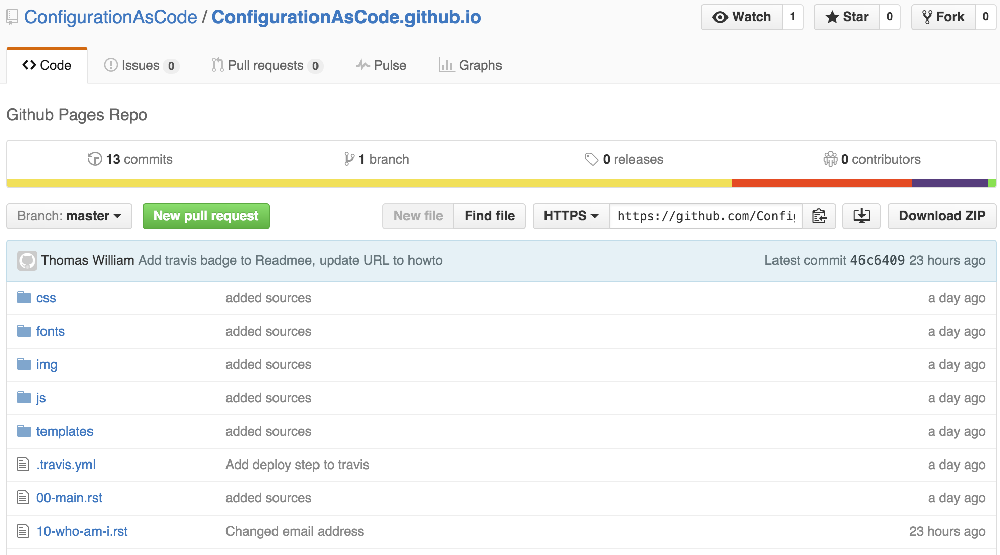
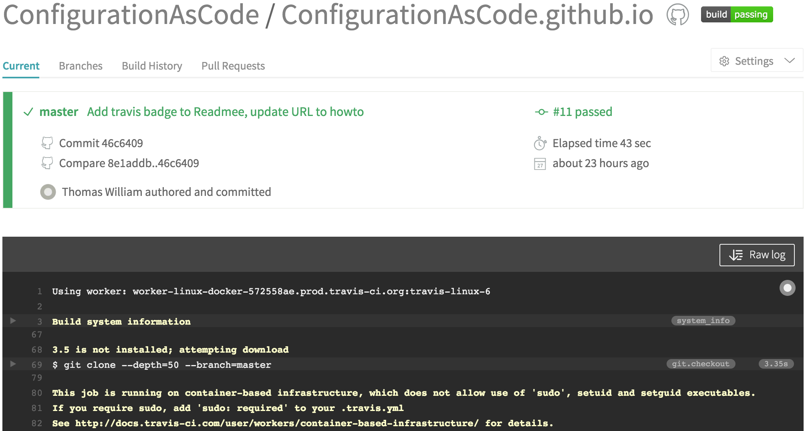
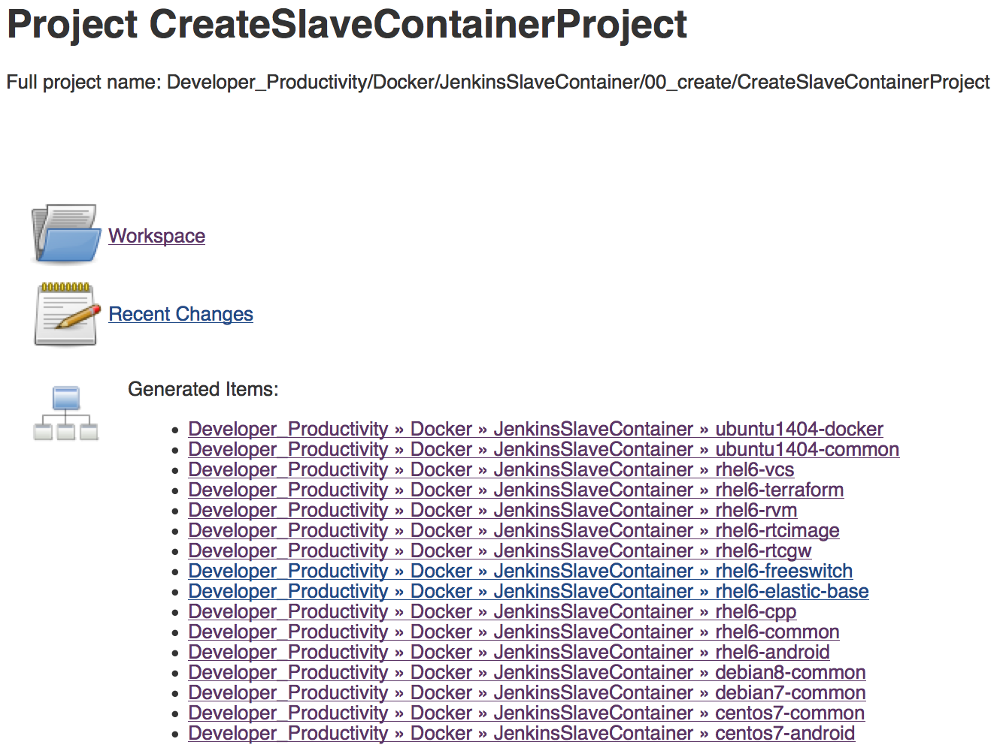

:class: slide

Configuration As Code
=====================

"Configuration as code" is a subset of the larger "infrastructure as code" concept:

- Adding of virtualization to the management of your configurations
- Not just managing what's on your systems but also the existence of the systems themselves

:class: slide

What does treating "configuration as code" mean in a pracital sense?  

- Configuration often !is! code
- Apache config file(s) is/are basically a programming environment already
 
What that means is using (good) practices common to the world of a programmer.

:class: slide

Revision Control And Deployment
===============================

- As "code" you manage it in a version control system, then you compile and deploy it out to a target system
- As "config" you edit configs in place on a system

:class: slide

Tests
=====

- Make it testable
- regression, unit, integration, load, security...
- Monitoring
- Development and test environments

:class: slide

Continuous Integration/Continuous Deploy
========================================

- Follow a process
	- Simple: design/code/test/deploy/maintain
- This can include more complex steps:
	- Modeling
	- Automated code validation
	- Defect tracking
	- Code reviews

:class: slide

Simple Example: This Talk
=========================
- Written in ReStructuredText
- Converted to HTML5
- Stored on Github
- Buildt using Travis CI

-> A commit/push to GitHub will trigger Travis that will build a new HTML file that is commited to Github which is then accessible via GitHub Pages.

- GitHub Repo: github.com_
- Travis CI: travis-ci.org_
- GitHub Pages: github.io_

.. _github.com: https://github.com/ConfigurationAsCode/ConfigurationAsCode.github.io
.. _travis-ci.org: https://travis-ci.org/ConfigurationAsCode/ConfigurationAsCode.github.io
.. _github.io: http://configurationascode.github.io/

:class: slide

GitHub Repo
===========

:class: slide highlight

Travis CI configuration
=======================

.. include:: src/.travis.yml

.. include:: src/requirements.txt

:class: slide highlight

Create index.html
=================

.. include:: src/make.sh

.. include:: src/create-sources.sh

:class: slide highlight

Commit index.html To GitHub
===========================

.. include:: src/deploy.sh

:class: slide

Travis CI
=========

:class: slide

CAS @ Citrix 1/2
================

- The build plans to create the docker images are create by jenkins jobs
	- Dependency graphs are built by parsing Dockerfiles
	- Plans trigger each other in right order
	- Change to base layer invokes rebuilt of upper layers
	- Configuration is completely stored in git repository

:class: slide

CAS @ Citrix 2/2
================

- To create a new docker image in Artifactory/Jenkins:
	- commit/push Dockerfile to git repository
	- *CreateAllSlaveImages* plan gets triggered by code change
	- *CreateAllSlaveImages* parses Dockerfile and triggers *CreateSlaveContainerProject* with Parameters
	- *CreateSlaveContainerProject* creates a Jenkins plan for new Dockerfile

:class: slide

One Plan For Each Dockerfile
============================

:class: slide

Live Demo Of Jenkins
====================
- The configuration of a plan changes with the sourcecode
- Adding endpoints (capabilities) to your code, you will need to change your build as well
- If you need to apply a hotfix for an old version, your changed build-plan will not work with the old source code base
- Your build machines may have changed (newer compiler versions etc.)

-> Solution is to save build plan (and requirements) alongside with the source code: *Jenkinsfile*

